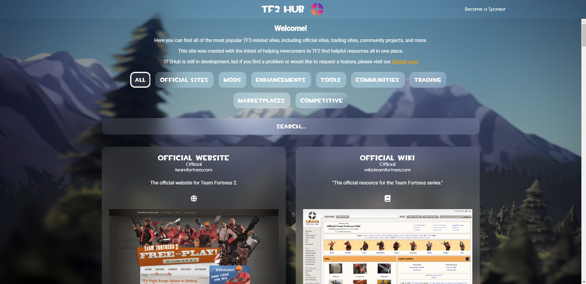

# TF2Hub.com

This is the code for the [tf2hub.com](https://tf2hub.com) website, written in Angular 10. Feel free to take a look around and submit new issues if you run into any problems.

To run the site locally, you'll need the [Angular CLI](https://cli.angular.io/). Just follow the directions in the README file under the `tf2hub` folder.

## Making a Feature Request

1. Under "Issues", click New Issue
2. Provide a title and description explaining the new feature
3. If requesting a new site, include the URL to the site along with any relevant social media URLs
4. Click Labels and apply the "enhancement" label
5. Click "Submit new issue"

## Making a Bug Report

1. Under "Issues", click New Issue
2. Provide a title and description explaining the problem
3. Provide steps to reproduce the problem and screenshots where appropriate
4. Click Labels and apply the "bug" label
5. Click "Submit new issue"
